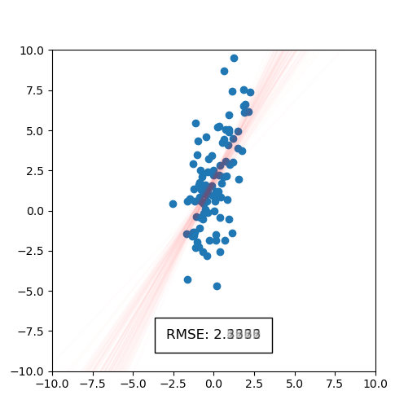

# Bootplot: bootstrap your plot

**bootplot** is a package that lets you easily visualize uncertainty. You only need to provide a function
that generates a plot from your data and pass it to `bootplot`. This will generate a static image and an
animation of your data uncertainty.

The method works by resampling the original dataset using bootstrap and plotting each bootstrapped sample.
The plots are then combined into a single image or an animation.
**bootplot** is also especially useful when dealing with small datasets, since it
relies on the bootstrap method which robustly estimates uncertainty using resampling.

## Installation

**bootplot** requires Python version 3.8 or greater. You can install it using:

```
pip install bootplot
```

Alternatively, you can install **bootplot** without PyPI:

```
git clone https://github.com/davidnabergoj/bootplot
cd bootplot
python setup.py install
```

## Example usage

Suppose we have some data and their corresponding targets. We can model our targets with a regression
line and visualize the uncertainty with the following code:

```python 
import numpy as np
from sklearn.linear_model import LinearRegression

from bootplot import bootplot


def make_linear_regression(data_subset, data_full, ax):
    # Plot full dataset
    ax.scatter(data_full[:, 0], data_full[:, 1])

    # Plot regression line trained on the subset
    lr = LinearRegression()
    lr.fit(data_subset[:, 0].reshape(-1, 1), data_subset[:, 1])
    xs = np.linspace(-10, 10, 1000)
    ax.plot(xs, lr.predict(xs.reshape(-1, 1)), c='r')
    
    # Show root mean squared error (RMSE) with a text box
    rmse = np.sqrt(np.mean(np.square(data_subset[:, 1] - lr.predict(data_subset[:, 0].reshape(-1, 1)))))
    ax.text(
        0, -8,
        f'RMSE: {rmse:.4f}',
        fontsize=12,
        ha='center',
        bbox=dict(facecolor='none', edgecolor='black', pad=10.0)
    )


if __name__ == '__main__':
    np.random.seed(0)

    # Dataset to be modeled
    dataset = np.random.randn(100, 2)
    noise = np.random.randn(len(dataset)) * 2.5
    dataset[:, 1] = dataset[:, 0] * 1.5 + 2 + noise

    # Create image and animation that show uncertainty
    bootplot(
        make_linear_regression,
        dataset,
        output_image_path='demo_image.png',
        output_animation_path='demo_animation.gif',
        xlim=(-10, 10),
        ylim=(-10, 10),
        verbose=True
    )
```

This will generate a static image and an animation, as shown below.
The static image on points shows the full scattered dataset in blue and regression lines that correspond to each
bootstrapped sample of the dataset in red.
The spread of regression lines represents uncertainty according to the bootstrap process.
We can also see the uncertainty in root mean squared error (RMSE).
We see that only the first digit of RMSE is significant, since the decimal part is blurred.
The animation on the right displays uncertainty by iterating over a sequence of plots containing regression lines.

<table>
    <tr>
        <td></td>
        <td></td>
    </tr>
</table>

See the `examples` folder for more examples, including bar charts, point plots, polynomial regression models, pie charts
and text plots.

## Documentation

Read the docs at https://bootplot.readthedocs.io/en/latest/
