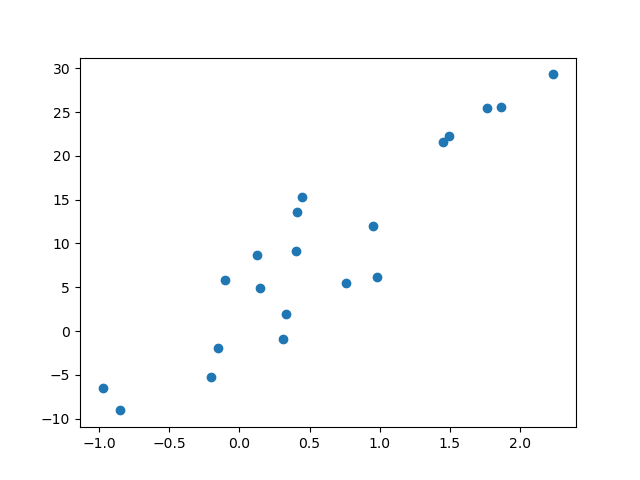
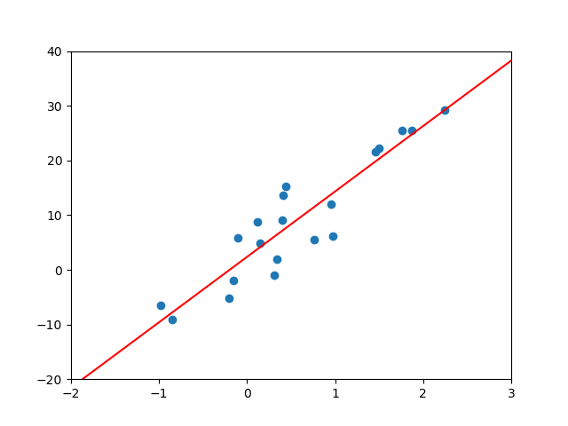
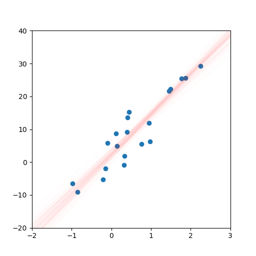
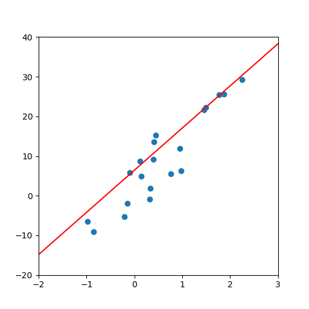

Quickstart
==========

In this short tutorial, we show a typical workflow with **bootplot**.
Before continuing, make sure you installed **bootplot** as shown in the :ref:`installation` section.

In this example, we will work with with a toy regression dataset.
We wish to fit a model to the dataset and estimate its uncertainty, but we don't want to perform any estimation ourselves.
Fortunately, we only need know how to make basic plots and **bootplot** will handle everything else in a black-box manner.

Note that **bootplot** can help in a wide range of analyses such as regression, classification, clustering and others.
For more examples, check the examples section.

Loading our data
----------------

We first have to load our dataset.
We can work with any dataset, but we will focus on a simple toy regression dataset for this example.
Our dataset contains 20 samples with a single feature.

.. code-block:: python

    from sklearn.datasets import make_regression
    x, y = make_regression(n_samples=20, n_features=1, random_state=0, noise=5.0)

We plot the dataset to see what we're working with:

.. code-block:: python

    import matplotlib.pyplot as plt
    plt.scatter(x, y)
    plt.show()

Fitting a regression line
-------------------------

It clearly looks like the data can be described with a regression line.
We will import a linear regression object, use it to fit the data and plot the data with the regression line.

.. code-block:: python

    from sklearn.linear_model import LinearRegression
    import numpy as np

    # Create and fit the linear regression object
    lr = LinearRegression()
    lr.fit(x, y)

    # Create some test data and create the regression plot
    test_x = np.linspace(-2, 3).reshape(-1, 1)
    fig, ax = plt.subplots()
    ax.scatter(x, y)
    ax.plot(test_x, lr.predict(test_x), c='r')

    # Define the plot limits
    ax.set_xlim(-2, 3)
    ax.set_ylim(-20, 40)

    plt.show()

Generating bootstrapped plots
-----------------------------

We now have a regression plot.
However, we still want to estimate the uncertainty in our model and we don't wish to do any explicit work ourselves.
Thankfully, **bootplot** will help us out.
We simply move the plotting code into a function and pass this function to ``bootplot``.

.. code-block:: python

    from bootplot import bootplot

    def plot_regression(data_subset, data_full, ax):
        lr = LinearRegression()
        lr.fit(data_subset[:, 0].reshape(-1, 1), data_subset[:, 1])
        test_x = np.linspace(-2, 3).reshape(-1, 1)
        ax.scatter(data_full[:, 0], data_full[:, 1])
        ax.plot(test_x, lr.predict(test_x), c='r')

    bootplot(
        plot_regression,
        data=np.column_stack([x, y]),
        output_image_path='quickstart_regression.png',
        output_animation_path='quickstart_regression.gif',
        xlim=(-2, 3),
        ylim=(-20, 40)
    )

The result is an image and an animation that both display regression line uncertainty:

.. note::
    It is often essential to manually specify axis limits.
    This is to ensure all bootstrapped plots cover the same area and hence use the same axis ticks.
    If axis limits are not provided, some image elements such as ticks may appear blurry depending on the plotting function.
    Axis limits may be specified in the plotting function or passed to ``bootplot`` (bootplot).
    The user will be warned and encouraged to provide limits if none are passed to ``bootplot``.
